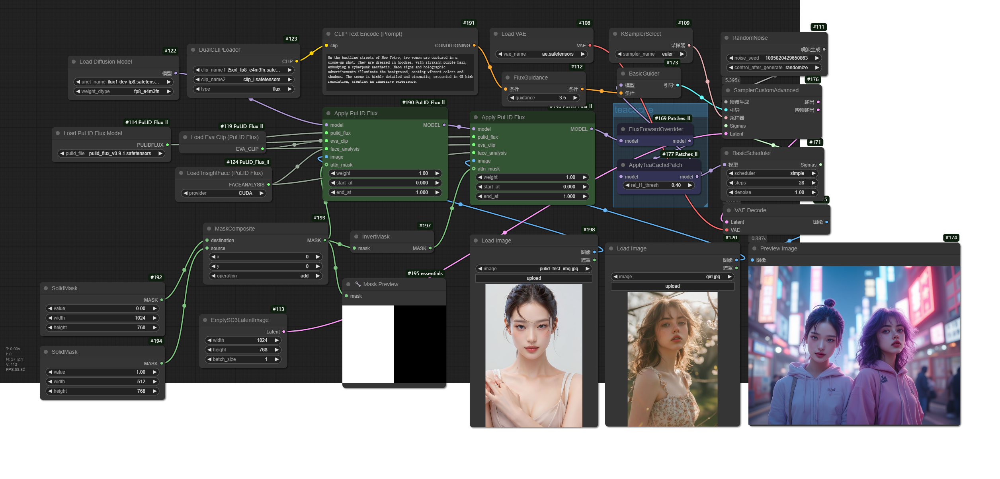
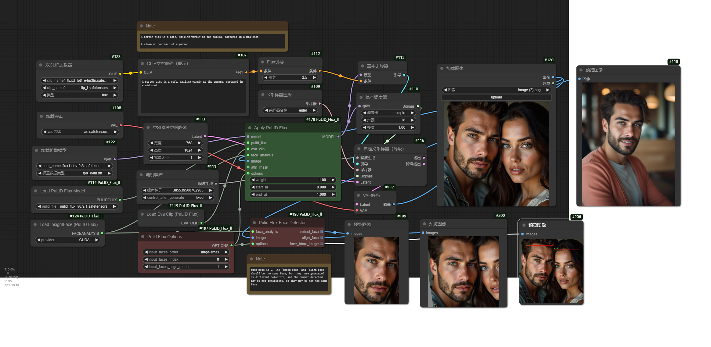

[English](README.md)

- 解决插件 [ComfyUI-PuLID-Flux](https://github.com/balazik/ComfyUI-PuLID-Flux) 存在的模型污染问题。
- 支持使用[TeaCache](https://github.com/ali-vilab/TeaCache)加速（`TeaCache`加速需要配合[ComfyUI_Patches_ll](https://github.com/lldacing/ComfyUI_Patches_ll)使用）。
- 支持使用[Comfy-WaveSpeed](https://github.com/chengzeyi/Comfy-WaveSpeed)加速, Comfy-WaveSpeed在[提交记录-36ba3c8](https://github.com/chengzeyi/Comfy-WaveSpeed/commit/36ba3c8b74735d4521828507a4bf323df1a9a9d0)中提供支持。
- 支持使用简单的`First Block Cache`加速（可以配合[ComfyUI_Patches_ll](https://github.com/lldacing/ComfyUI_Patches_ll)使用）。

在安装此插件之前，必须卸载或禁用`ComfyUI-PuLID-Flux`和其他PuLID Flux节点, 因为由于某些原因，我使用了同样的节点名`ApplyPulidFlux`

ComfyUI主体版本需要>=0.3.7

## 更新日志
### 2025.02.18
- 支持从含有多张脸的图片中选择一张脸作为参考。
### 2025.01.27
- 修改 facexlib 的模型路径为 `ComfyUI/models/facexlib/`.
- 自动下载时 修改 Antelopev2 模型的路径为 `ComfyUI/models/insightface/models/antelopev2/`.
- 修改 EVA_CLIP_L_14_336 的模型路径为 `ComfyUI/models/clip/`.

## 预览 (图片含工作流)




## 安装

- 手动
```shell
    cd custom_nodes
    git clone https://github.com/lldacing/ComfyUI_PuLID_Flux_ll.git
    cd ComfyUI_PuLID_Flux_ll
    pip install -r requirements.txt
    # 重启 ComfyUI
```
安装问题:

- 如果使用`ComfyUI_windows_portable`并遇到以下错误, 请查看 https://github.com/deepinsight/insightface/issues/2576
```
insightface/thirdparty/face3d/mesh/cython/mesh_core_cython.cpp(36): fatal error C1083: 无法打开包括文件: “Python.h”: No such file or directory
      error: command 'd:\\installed\\Microsoft Visual Studio\\2022\\BuildTools\\VC\\Tools\\MSVC\\14.42.34433\\bin\\HostX86\\x64\\cl.exe' failed with exit code 2
      [end of output]

  note: This error originates from a subprocess, and is likely not a problem with pip.
  ERROR: Failed building wheel for insightface
Failed to build insightface
```

## 模型
### 可用的 Flux 模型
- 32bit/16bit (~22GB VRAM): [model](https://huggingface.co/black-forest-labs/FLUX.1-dev/blob/main/flux1-dev.safetensors), [encoder](https://huggingface.co/comfyanonymous/flux_text_encoders/blob/main/t5xxl_fp16.safetensors)
- 8bit gguf (~12GB VRAM): [model](https://huggingface.co/city96/FLUX.1-dev-gguf/blob/main/flux1-dev-Q8_0.gguf), [encoder](https://huggingface.co/city96/t5-v1_1-xxl-encoder-gguf/blob/main/t5-v1_1-xxl-encoder-Q8_0.gguf)
- 8 bit FP8 e5m2 (~12GB VRAM): [model](https://huggingface.co/Kijai/flux-fp8/blob/main/flux1-dev-fp8-e5m2.safetensors), [encoder](https://huggingface.co/comfyanonymous/flux_text_encoders/blob/main/t5xxl_fp8_e4m3fn.safetensors)
- 8 bit FP8 e4m3fn (~12GB VRAM): [model](https://huggingface.co/Kijai/flux-fp8/blob/main/flux1-dev-fp8-e4m3fn.safetensors), [encoder](https://huggingface.co/comfyanonymous/flux_text_encoders/blob/main/t5xxl_fp8_e4m3fn.safetensors)
- Clip and VAE (for all models): [clip](https://huggingface.co/comfyanonymous/flux_text_encoders/blob/main/clip_l.safetensors), [vae](https://huggingface.co/black-forest-labs/FLUX.1-schnell/blob/main/ae.safetensors)

#### 若使用 GGUF 需要安装 [ComfyUI-GGUF](https://github.com/city96/ComfyUI-GGUF) 

### PuLID 模型
- 下载 [PuLID-Flux](https://huggingface.co/guozinan/PuLID/resolve/main/pulid_flux_v0.9.1.safetensors?download=true) 到目录 `ComfyUI/models/pulid/`
- （支持自动下载）下载 [EVA02-CLIP-L-14-336](https://huggingface.co/QuanSun/EVA-CLIP/blob/main/EVA02_CLIP_L_336_psz14_s6B.pt?download=true) 到目录 `ComfyUI/models/clip/`
- （支持自动下载）从 [AntelopeV2](https://huggingface.co/MonsterMMORPG/tools/tree/main) 下载所有`*.onnx`模型文件到目录 `ComfyUI/models/insightface/models/antelopev2/`.
- （支持自动下载）下载 [parsing_bisenet](https://github.com/xinntao/facexlib/releases/download/v0.2.0/parsing_bisenet.pth), [parsing_parsenet](https://github.com/xinntao/facexlib/releases/download/v0.2.2/parsing_parsenet.pth) and [Resnet50](https://github.com/xinntao/facexlib/releases/download/v0.1.0/detection_Resnet50_Final.pth) 到目录 `ComfyUI/models/facexlib/`.

## 节点
- PulidFluxModelLoader
- PulidFluxInsightFaceLoader
- PulidFluxEvaClipLoader
- ApplyPulidFlux
  - 解决了原插件中模型污染的问题
  - `attn_mask`~~可能不能正确工作， 因为我不知道如何实现它， 尝试了多种方式效果都未能达到预期~~，可以正常工作了。
  - 使用 [TeaCache](https://github.com/ali-vilab/TeaCache)加速, 必须加在[`FluxForwardOverrider` and `ApplyTeaCachePatch`](https://github.com/lldacing/ComfyUI_Patches_ll)之前.
  - 使用 [Comfy-WaveSpeed](https://github.com/chengzeyi/Comfy-WaveSpeed)加速, 必须加在[`ApplyFBCacheOnModel`](https://github.com/lldacing/ComfyUI_Patches_ll)之前.
- FixPulidFluxPatch (已弃用)
  - 如果想使用 [TeaCache](https://github.com/ali-vilab/TeaCache)加速, 必须加在 `ApplyPulidFlux` 节点之后, 并在后面连接节点 [`FluxForwardOverrider` and `ApplyTeaCachePatch`](https://github.com/lldacing/ComfyUI_Patches_ll).
- PulidFluxOptions
  - `input_faces_order` - 对检测到的脸部边界框的排序规则。
    - `left-right`: 按列从左到右对bbox的左边界进行排序。
    - `right-left`: `left-right`的倒序（按列从右到左对bbox的左边界进行排序）。
    - `top-bottom`: 按行从上到下对bbox的顶部边界进行排序。
    - `bottom-top`: `top-bottom`的倒序（按行从下到上对bbox的顶部边界进行排序）。
    - `small-large`: 按bbox的面积从小到大排序。
    - `large-small`: 按bbox的面积从大到小排序。
  - `input_faces_index` - 从排序后的bbox选取的索引号。
- PulidFluxFaceDetector
  - 用来检查在`ApplyPulidFlux`实际使用的面部特征。
  - `embed_face` 和 `align_face` 理论上应该是同一张脸，但它们产生不同的探测器，可能检测到的数量不一致，因此两张图可能不是同一张脸。

## 感谢

[ToTheBeginning/PuLID](https://github.com/ToTheBeginning/PuLID)

[ComfyUI-PuLID-Flux](https://github.com/balazik/ComfyUI-PuLID-Flux)

[TeaCache](https://github.com/ali-vilab/TeaCache)

[Comfy-WaveSpeed](https://github.com/chengzeyi/Comfy-WaveSpeed)